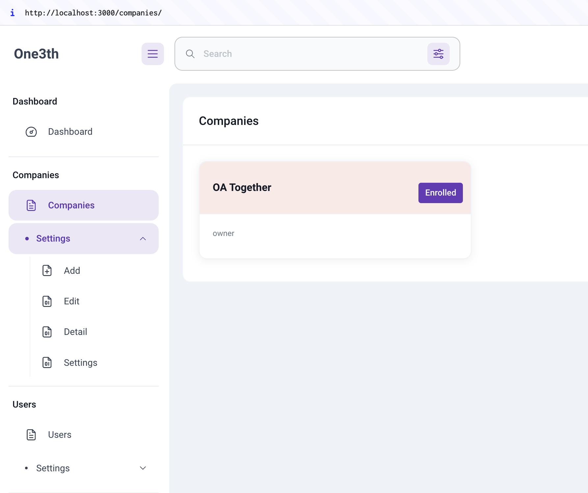

# One3th Management

  <!-- Add an actual image path if available -->

## Overview

One3th Management is a comprehensive web application designed to streamline and simplify small business operations. This project includes features for managing invoices, expenses, appointments, tasks, inventory, customer relationships, and more.

## Features

- **Invoicing and Billing**: Create, send, and track invoices.
- **Expense Tracking**: Record and monitor business expenses.
- **Appointment Scheduling**: Manage appointments with a built-in calendar system.
- **Task Management**: Create, assign, and track tasks.
- **Inventory Management**: Track inventory levels and manage stock.
- **Customer Relationship Management (CRM)**: Organize customer contact information and interactions.
- **Reporting and Analytics**: Generate and visualize business reports.
- **User Management**: Manage user roles and permissions.
- **Authentication**: Secure access with user authentication.

## Installation

1. **Clone the repository:**

    ```bash
    git clone git@github.com:olialvesrobson/one3th.git
    cd one3th
    ```

2. **Install dependencies:**

    ```bash
    npm install
    ```

3. **Run the development server:**

    ```bash
    npm start
    ```

4. **Access the application:**

    Open your browser and go to `http://localhost:3000/`.

## Usage

### Invoicing

Create and manage invoices effortlessly.

```jsx
import { useDispatch } from 'react-redux';
import { createInvoice } from './actions/invoiceActions';

const dispatch = useDispatch();
const invoiceData = {
  customer: 'John Doe',
  amount: 500.00,
  dueDate: '2024-07-08',
};

dispatch(createInvoice(invoiceData));
```

### Expense Tracking

Keep track of all your business expenses.

```jsx
import { useDispatch } from 'react-redux';
import { createExpense } from './actions/expenseActions';

const dispatch = useDispatch();
const expenseData = {
  category: 'Office Supplies',
  amount: 100.00,
  date: '2024-07-08',
};

dispatch(createExpense(expenseData));
```

### Appointment Scheduling

Schedule and manage appointments with ease.

```jsx
import { useDispatch } from 'react-redux';
import { createAppointment } from './actions/appointmentActions';

const dispatch = useDispatch();
const appointmentData = {
  client: 'Jane Smith',
  date: '2024-07-10',
  time: '10:00:00',
};

dispatch(createAppointment(appointmentData));
```

### Task Management

Organize and prioritize tasks efficiently.

```jsx
import { useDispatch } from 'react-redux';
import { createTask } from './actions/taskActions';

const dispatch = useDispatch();
const taskData = {
  title: 'Prepare financial report',
  description: 'Prepare the monthly financial report',
  dueDate: '2024-07-15',
};

dispatch(createTask(taskData));
```

### Inventory Management

Maintain control over your inventory.

```jsx
import { useDispatch } from 'react-redux';
import { createInventoryItem } from './actions/inventoryActions';

const dispatch = useDispatch();
const itemData = {
  name: 'Tennis Balls',
  quantity: 100,
  price: 2.50,
};

dispatch(createInventoryItem(itemData));
```

### Customer Relationship Management (CRM)

Manage customer interactions and data.

```jsx
import { useDispatch } from 'react-redux';
import { createCustomer } from './actions/customerActions';

const dispatch = useDispatch();
const customerData = {
  name: 'John Doe',
  email: 'john.doe@example.com',
  phone: '123-456-7890',
};

dispatch(createCustomer(customerData));
```

### Reporting and Analytics

Generate insightful business reports.

```jsx
import { generateMonthlyReport } from './reports';

const report = generateMonthlyReport('July', 2024);
console.log(report);
```

## Contributing

1. **Fork the repository**
2. **Create a new branch**

    ```bash
    git checkout -b feature-branch
    ```

3. **Commit your changes**

    ```bash
    git commit -am 'Add new feature'
    ```

4. **Push to the branch**

    ```bash
    git push origin feature-branch
    ```

5. **Create a new Pull Request**

## License

This project is licensed under the MIT License. See the [LICENSE](LICENSE) file for details.
